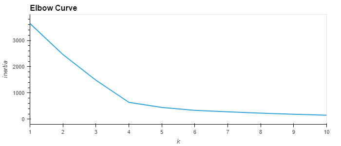
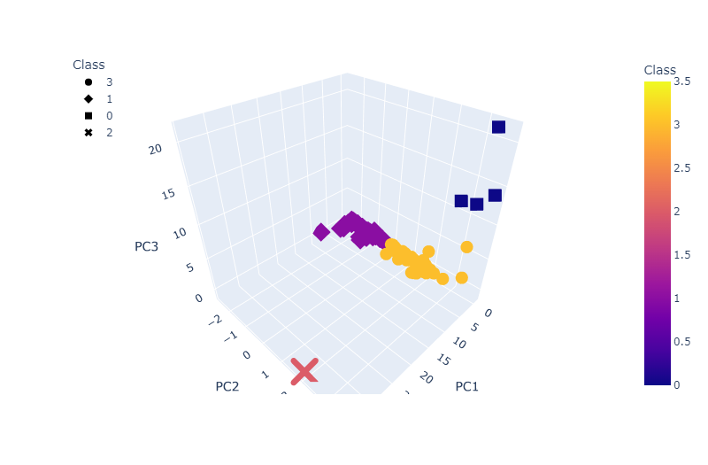
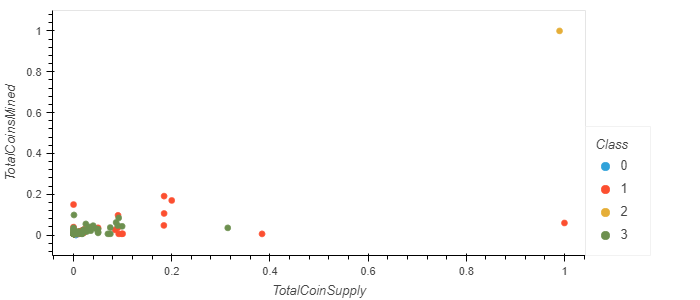

# Cryptocurrencies
Machine Learning - Unsupervised Learning

## Purpose of this analysis:
Martha is a senior manager for the Advisory Services Team at Accountability Accounting, one of my most import clients.
They are interested in offering a new cryptocurrency investment portfolio for its customers, but they are lost in the vast universe of cryptocurrencies.
I need to run codes with Python to know what cryptocurrencies are on the trading market and how they could be grouped to create a classification system
for this new investment. 

### Work on this analysis:
- Deliverable 1: Preprocessing the Data for PCA
  - PCA (Principle Component Analysis): PCA reduces number of dimensions by transforming a large set of variables into a smaller one
- Deliverable 2: Reducing Data Dimensions Using PCA
- Deliverable 3: Clustering Cryptocurrencies Using K-means
  - K-means algorithm: is an unsupervised learning algorithm used to identify and solve clustering issues
- Deliverable 4: Visualizing Cryptocurrencies Results

